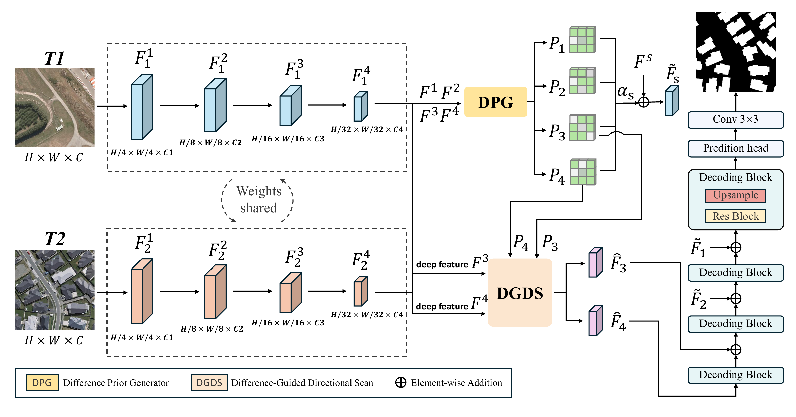
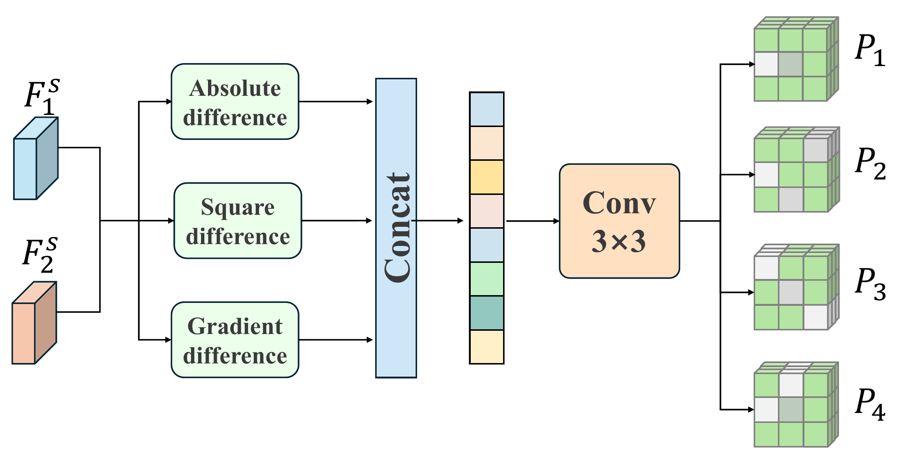
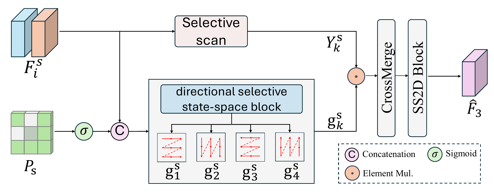
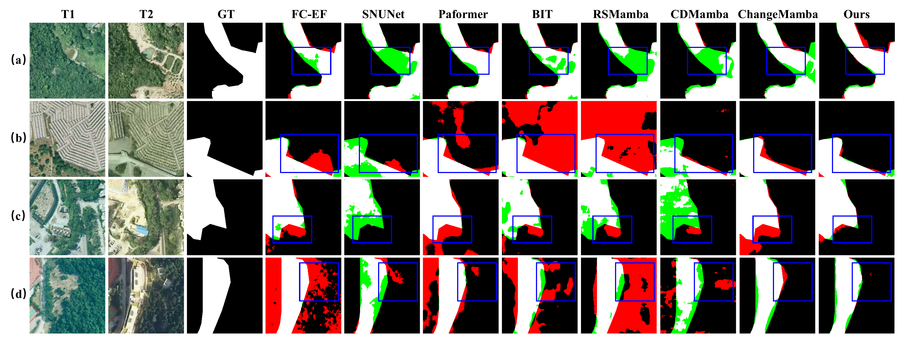
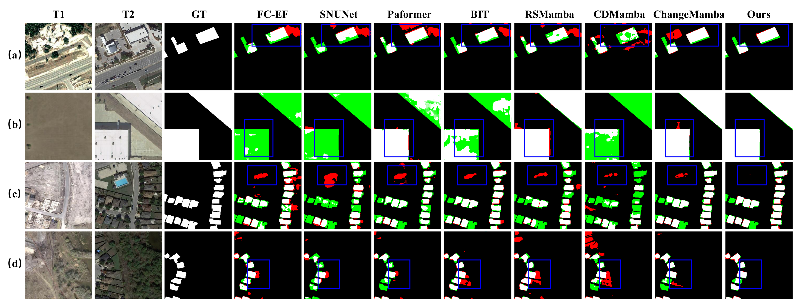
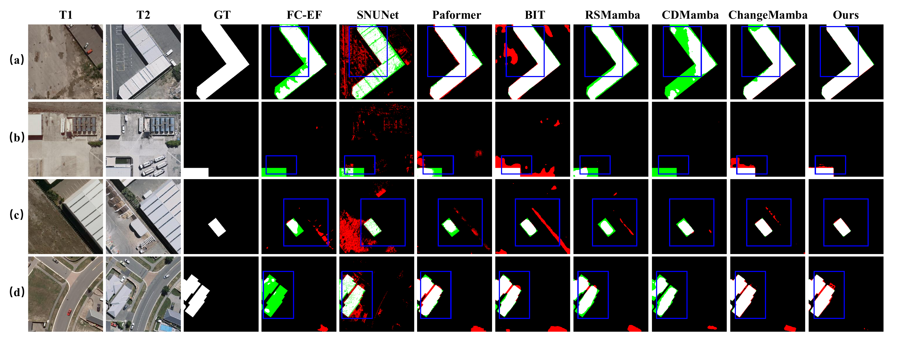
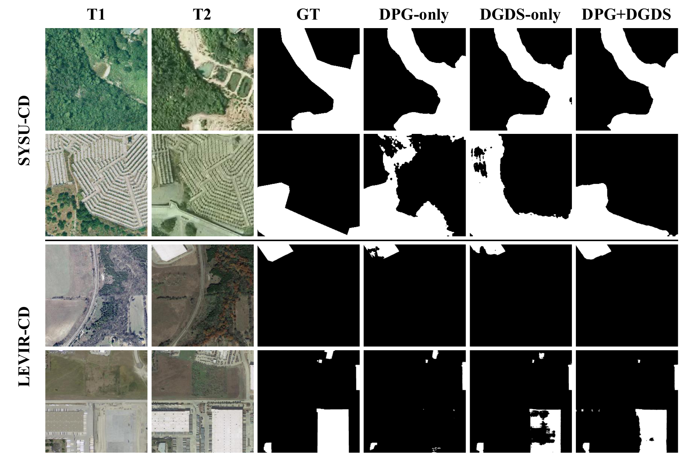
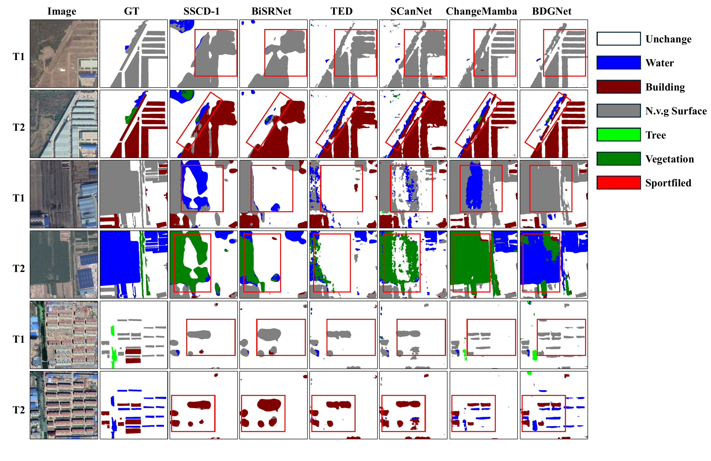

# BDGNet: Explicit Multi-Scale Difference Priors with Difference-Guided Directional Response Adaptation for Remote Sensing Change Detection

**Note:** This is the official project repository of **BDGNet**. The source code, pretrained models, and training/inference instructions will be released after being organized.

## BDGNet

BDGNet is designed for bi-temporal remote sensing change detection, where reliable localization requires both fine-grained difference cues and robust long-range context modeling. The network introduces explicit multi-scale difference priors to guide feature learning rather than relying only on implicit feature differencing. Its Difference Prior Generator (DPG) builds scale-specific priors from absolute, squared, and gradient discrepancies, then injects them through zero-initialized residual paths. At deeper stages, Difference-Guided Directional Scan (DGDS) reuses the DPG prior to modulate four directional selective responses before CrossMerge while keeping the state-space recurrence unchanged. BDGNet is evaluated on binary change detection benchmarks and the SECOND semantic change detection benchmark.

### Difference Prior Generator

### Difference-Guided Directional Scan

### Qualitative Comparison on SYSU-CD

### Qualitative Comparison on LEVIR-CD

### Qualitative Comparison on WHU-CD

### Qualitative Ablation

### Semantic Change Detection on SECOND

## Dependency

Coming Soon...

## Data Preparation

Coming Soon...

## Quick Start

Coming Soon...

## Pretrained Models

Coming Soon...

## Citation

Citation information will be updated after publication.

## Acknowledgment

This work is implemented with inspiration from recent state-space and remote sensing change detection studies, including ChangeMamba and VMamba.
